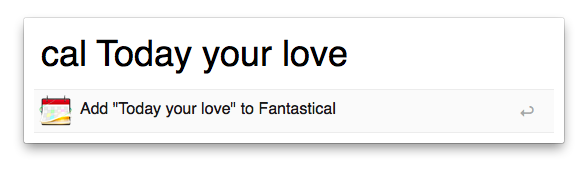
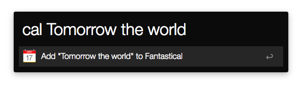

# Fantastical Alfred Workflow

A simple [Alfred 2](http://www.alfredapp.com/) workflow to add entries to [Fantastical](http://flexibits.com/fantastical).

    
    

## How to install

Clone this repo into `Alfred.alfredpreferences/workflows/Fantastical`, or
[download the `.workflow` file from the Releases page](https://github.com/robb/Fantastical-Alfred-Workflow/releases/).

Released under a [CC0 license](https://creativecommons.org/publicdomain/zero/1.0/).
